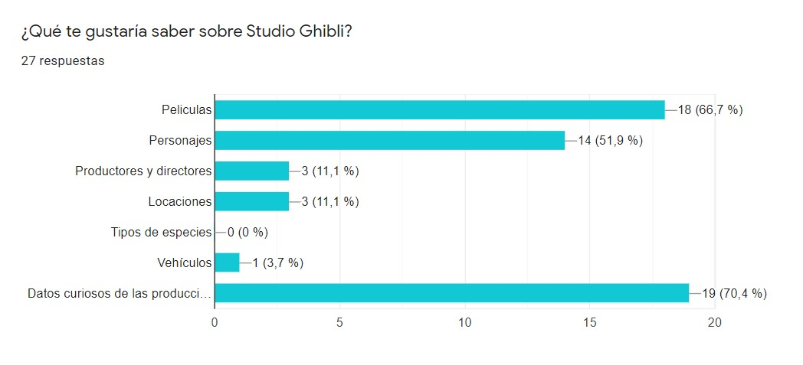
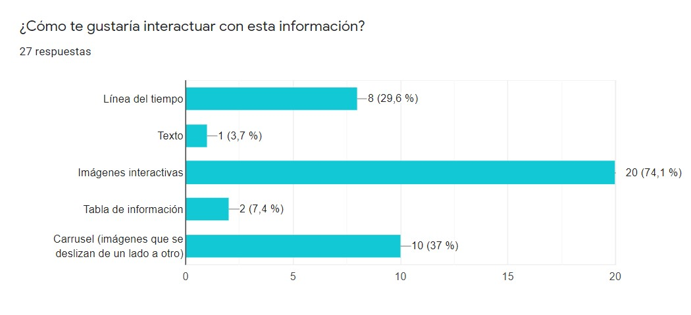
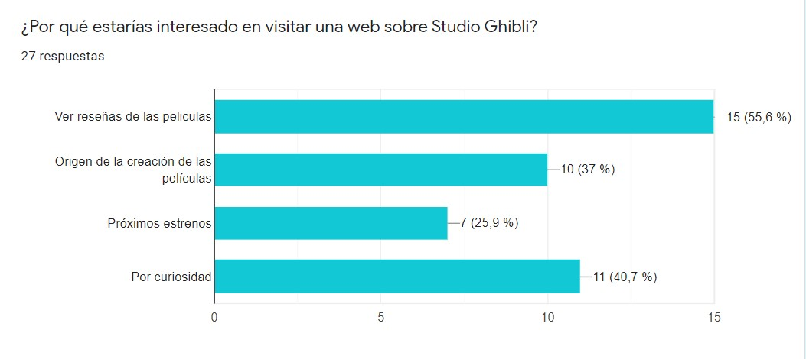
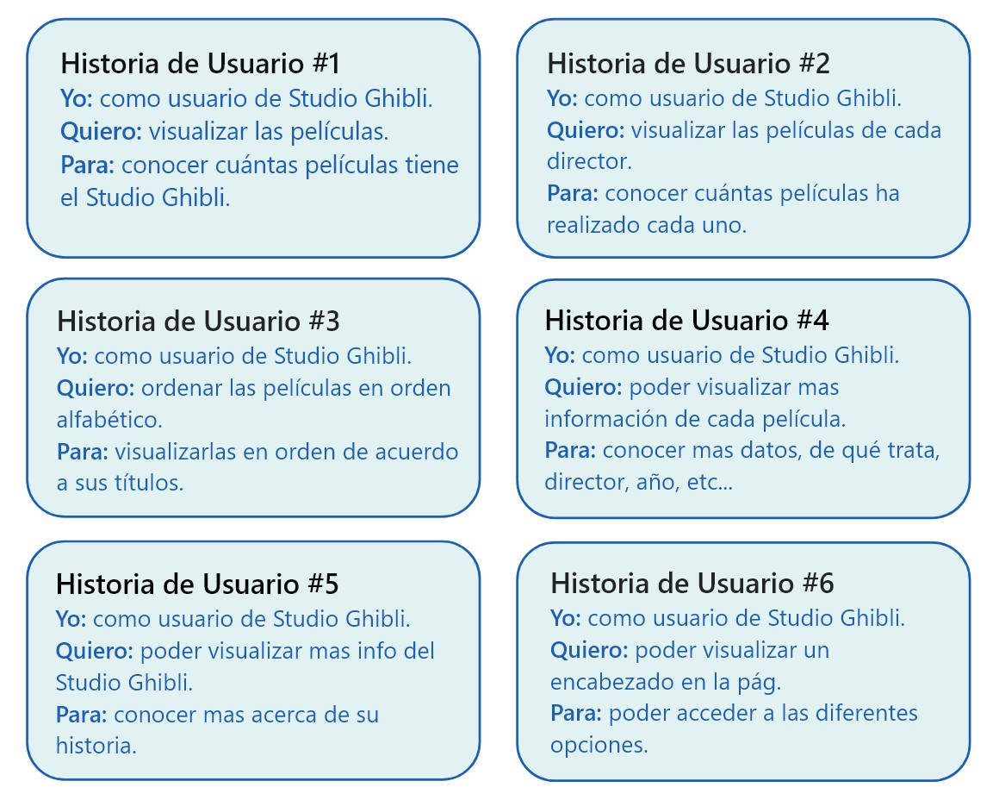
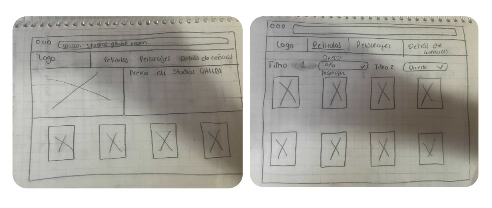
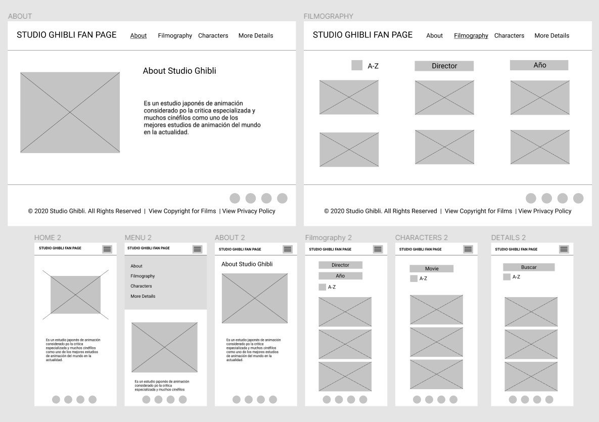
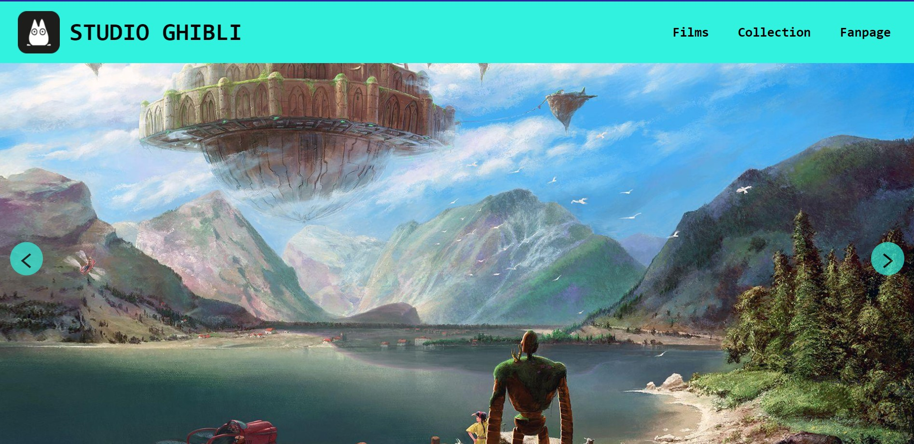
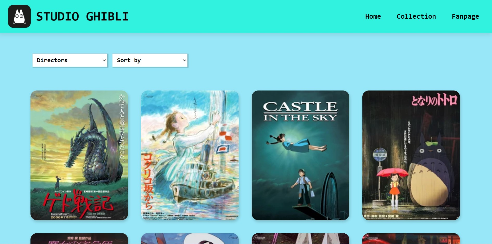
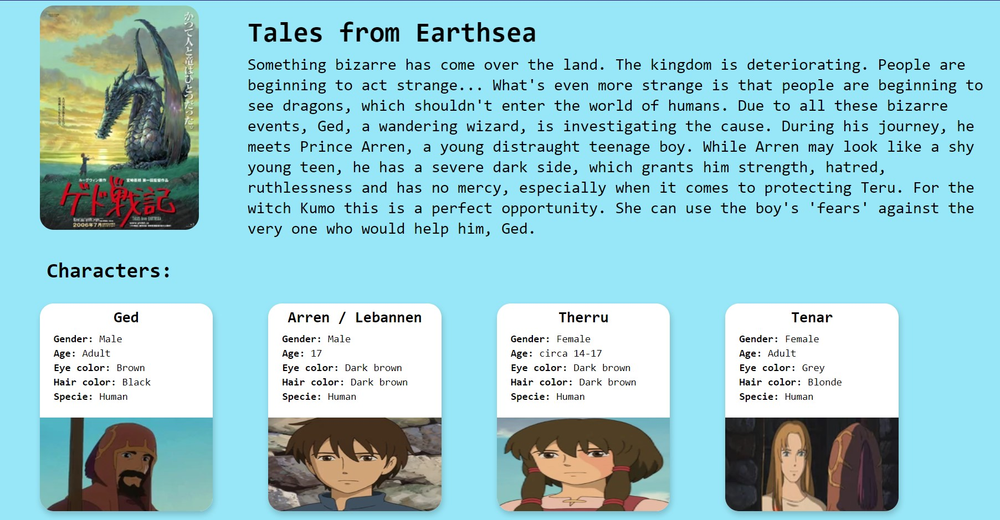

# Studio Ghibli

## Índice

* [1. Definición del producto](#1-definición-del-producto)
* [2. Historias de usuario](#2-historias-de-usuario)
* [3. Prototipos](#3-prototipos)

***

## 1. Definición del producto

**¿Quiénes son los principales usuarios del producto?**

* Hombres y mujeres de entre 20 a 32 años.

**¿Cuáles son los objetivos de estos usuarios en relación con el producto?**

* Obtener más información sobre las películas, personajes y datos curiosos de Studios Ghibli.
* Interés por conocer las animaciones japonesa.
* Para estar informado de próximos estrenos.

**¿Cuáles son los datos más relevantes que el usuario quiere ver en la interfaz y por qué?**

* Reseñas de las películas - para tener un contexto general de la película y ver si le interesa verla.
* Origen de la creación de las películas - para conocer el trasfondo de la película.
* Conocer a los personajes de cada pelicula.

**¿Cuándo utilizan o utilizarían el producto?**

* Cuando surja el interés de ver una película de Studios Ghibli y el usuario quiera obtener más información de esta película.
* Para enterarte de los próximos estrenos y avances.
* Para saber datos curiosos de las producciones.
* Para investigación o implementación de un proyecto relacionado a este tema.

**Algunas respuestas de la encuesta:**

## 2. Historias de usuario:

## 3. Prototipos:

